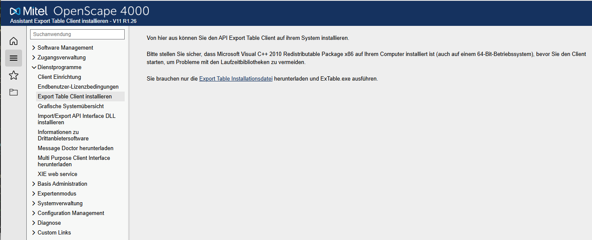
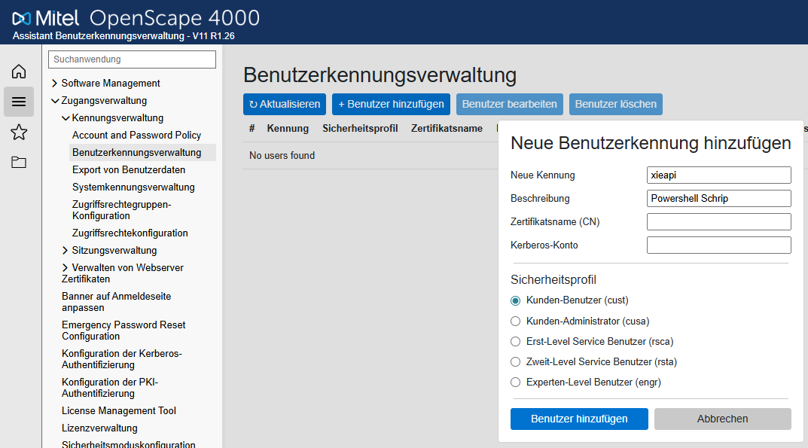
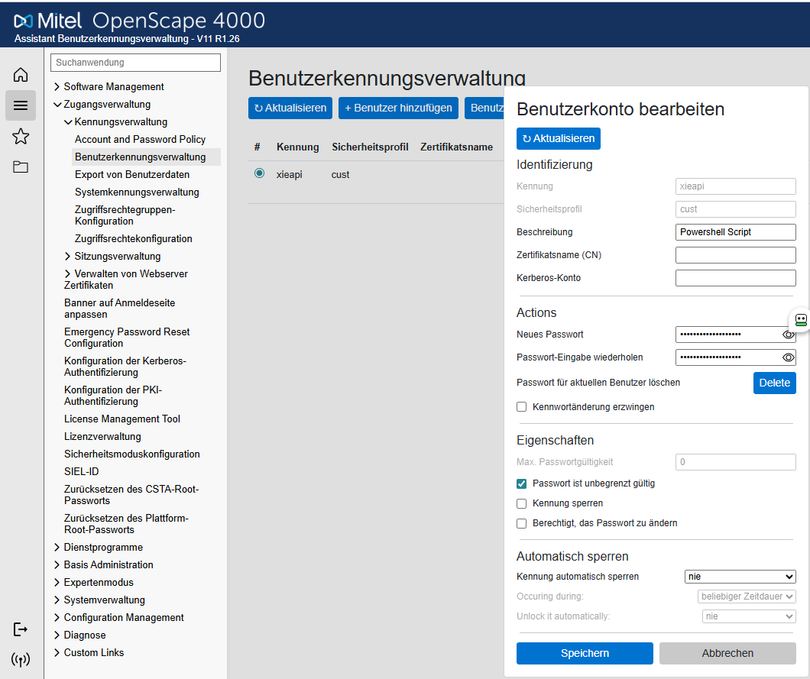
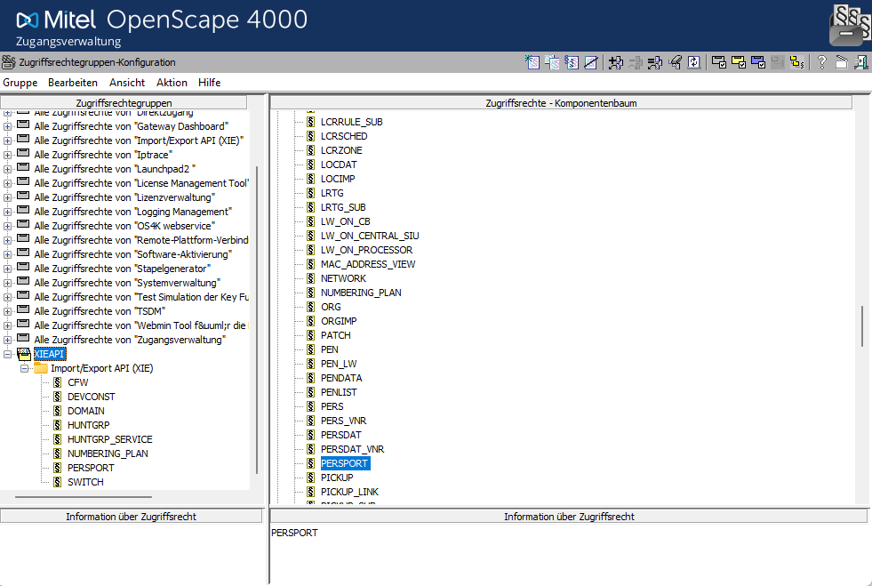
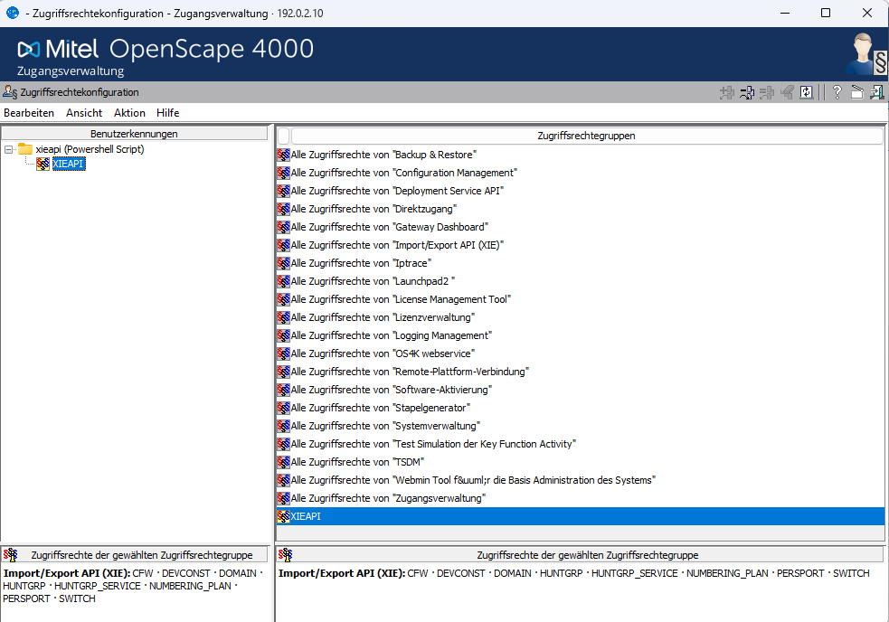

# Installation

Schritt-für-Schritt Anleitung zur Installation von os4k2excel.

## Schritt 1: Voraussetzungen überprüfen

### System
- **Windows:** 10, 11, Server 2016+
- **PowerShell:** 5.1+ (in Windows enthalten)
- **.NET Framework:** 4.5+ (in Windows enthalten)

### Software
- **api2hipath.exe** — XIE-API Tool von Unify/Mitel
  - Bestandteil von OpenScape 4000 Assistant/Manager V11
  - Standardpfad: `C:\Program Files (x86)\Unify\OpenScape 4000 Export Table\api2hipath.exe`
  - Muss lokal installiert sein
  - Dokumentation: [XIE API Service Documentation](https://www.mitel.com/document-center/business-phone-systems/openscape-4000-ecosystem/openscape-4000/110/en/openscape-4000-assistantmanager-v11-importexport-xie-api-service-documentation)

### Netzwerk
- Netzwerkzugriff zum OpenScape 4000 Server
- Port 8080 frei (für Webserver, optional)

## Schritt 2: PowerShell-Module installieren

### ImportExcel Modul

Das Script benötigt das **[ImportExcel](https://www.powershellgallery.com/packages/ImportExcel/)** Modul, um Excel-Dateien ohne Microsoft Office zu erstellen (basiert auf EPPlus/OfficeOpenXml).

---

### Variante A: Online-Installation (mit Internetverbindung)

Wenn der PC Internetzugang hat, kann das Modul direkt aus der [PowerShell Gallery](https://www.powershellgallery.com/packages/ImportExcel/) installiert werden.

**1. NuGet Package Provider installieren** (falls noch nicht vorhanden):
```powershell
Install-PackageProvider -Name NuGet -MinimumVersion 2.8.5.201 -Force
```

**2. PSGallery als vertrauenswürdige Quelle setzen** (optional, vermeidet Rückfragen):
```powershell
Set-PSRepository -Name PSGallery -InstallationPolicy Trusted
```

**3. ImportExcel installieren:**
```powershell
Install-Module -Name ImportExcel -Scope CurrentUser
```

Bei der ersten Installation wird nach Bestätigung gefragt:
- NuGet-Paket installieren → `Y`
- PSGallery Repository vertrauen → `Y`

**4. Installation überprüfen:**
```powershell
Get-Module -ListAvailable ImportExcel
```

**5. Update auf neueste Version** (zu einem späteren Zeitpunkt):
```powershell
Update-Module -Name ImportExcel
```

---

### Variante B: Offline-Installation (PC ohne Internetverbindung)

Wenn der Ziel-PC keinen Internetzugang hat (z.B. in abgeschotteten Netzwerken), muss das Modul auf einem anderen PC heruntergeladen und manuell übertragen werden.

#### Schritt B.1: Modul herunterladen (auf einem PC MIT Internet)

Es gibt zwei Wege:

**Weg 1 — Per PowerShell (empfohlen):**
```powershell
# Modul in einen beliebigen Ordner herunterladen (wird NICHT installiert)
Save-Module -Name ImportExcel -Path "C:\Temp\PSModules"
```
Das erstellt automatisch die korrekte Ordnerstruktur:
```
C:\Temp\PSModules\
  └── ImportExcel\
      └── 7.8.10\          ← Versionsnummer (Beispiel)
          ├── ImportExcel.psd1
          ├── ImportExcel.psm1
          └── ...
```

**Weg 2 — Manueller Download über den Browser:**
1. Öffne https://www.powershellgallery.com/packages/ImportExcel/
2. Klicke auf den Tab **"Manual Download"**
3. Klicke auf **"Download the raw nupkg file"**
4. Die Datei `importexcel.<version>.nupkg` wird heruntergeladen
5. Dateiendung von `.nupkg` in **`.zip`** umbenennen
6. ZIP-Datei entpacken (Rechtsklick → "Alle extrahieren")
7. Im entpackten Ordner befinden sich die Modul-Dateien (`ImportExcel.psd1`, `ImportExcel.psm1`, etc.)
8. Den Ordner in **`ImportExcel`** umbenennen (ohne Versionsnummer im Namen)
9. Die Dateien `[Content_Types].xml`, `_rels/` und `package/` können gelöscht werden — sie gehören zum NuGet-Paketformat und werden nicht benötigt

#### Schritt B.2: Dateien auf den Offline-PC übertragen

Den Ordner `ImportExcel` (inkl. aller Unterordner und Dateien) per **USB-Stick**, **Netzlaufwerk** oder **anderem Medium** auf den Ziel-PC kopieren.

#### Schritt B.3: Modul auf dem Offline-PC installieren

Das Modul muss in einen der PowerShell-Modulpfade kopiert werden:

**Option 1 — Nur für den aktuellen Benutzer** (kein Admin erforderlich):
```powershell
# Zielpfad
$targetPath = "$env:USERPROFILE\Documents\WindowsPowerShell\Modules\ImportExcel"

# Ordner erstellen
New-Item -Path $targetPath -ItemType Directory -Force

# Dateien vom USB-Stick kopieren (Laufwerk anpassen!)
Copy-Item -Path "D:\ImportExcel\*" -Destination $targetPath -Recurse -Force
```

**Option 2 — Für alle Benutzer auf dem PC** (PowerShell als Administrator starten):
```powershell
# Zielpfad (systemweit)
$targetPath = "C:\Program Files\WindowsPowerShell\Modules\ImportExcel"

# Ordner erstellen
New-Item -Path $targetPath -ItemType Directory -Force

# Dateien vom USB-Stick kopieren (Laufwerk anpassen!)
Copy-Item -Path "D:\ImportExcel\*" -Destination $targetPath -Recurse -Force
```

#### Schritt B.4: Installation überprüfen

```powershell
# Modul muss in der Liste erscheinen
Get-Module -ListAvailable ImportExcel

# Test-Import durchführen
Import-Module ImportExcel

# Verfügbare Befehle anzeigen (sollte ca. 40+ Befehle zeigen)
Get-Command -Module ImportExcel | Measure-Object
```

#### Korrekte Verzeichnisstruktur

PowerShell erkennt das Modul nur, wenn die Dateien korrekt abgelegt sind:

```
...\Modules\
  └── ImportExcel\                  ← Ordnername MUSS "ImportExcel" heissen
      ├── ImportExcel.psd1          ← Modul-Manifest (Pflicht)
      ├── ImportExcel.psm1          ← Modul-Code
      └── ...                       ← weitere Dateien
```

Alternativ mit Versionsunterordner (wird von `Save-Module` automatisch erstellt):
```
...\Modules\
  └── ImportExcel\
      └── 7.8.10\                   ← Versionsnummer
          ├── ImportExcel.psd1
          ├── ImportExcel.psm1
          └── ...
```

Beide Varianten werden von PowerShell erkannt.

---

### Modulpfade nachschlagen

Falls unsicher, welche Pfade PowerShell durchsucht:
```powershell
$env:PSModulePath -split ';'
```

Typische Ausgabe:
| Pfad | Geltungsbereich |
|---|---|
| `C:\Users\<Name>\Documents\WindowsPowerShell\Modules` | Aktueller Benutzer |
| `C:\Program Files\WindowsPowerShell\Modules` | Alle Benutzer |
| `C:\Windows\System32\WindowsPowerShell\v1.0\Modules` | System (nicht verwenden) |

### ImportExcel aktualisieren (Update)

PowerShell-Module werden **nicht automatisch** aktualisiert. Updates müssen manuell angestossen werden.

#### Installierte Version abfragen

```powershell
# Installierte Version anzeigen
Get-Module -ListAvailable ImportExcel | Select-Object Name, Version, ModuleBase
```

Beispiel-Ausgabe:
```
Name          Version ModuleBase
----          ------- ----------
ImportExcel   7.8.10  C:\Users\MeinName\Documents\WindowsPowerShell\Modules\ImportExcel\7.8.10
```

Falls **keine Ausgabe** erscheint, ist das Modul nicht installiert — siehe [Variante A](#variante-a-online-installation-mit-internetverbindung) oder [Variante B](#variante-b-offline-installation-pc-ohne-internetverbindung).

Falls **mehrere Zeilen** erscheinen, sind mehrere Versionen parallel installiert. PowerShell verwendet automatisch die neueste. Alte Versionen können entfernt werden — siehe [Alte Versionen aufräumen](#alte-versionen-aufräumen).

#### Update — Online (mit Internetverbindung)

```powershell
# 1. Aktuell installierte Version prüfen
Get-Module -ListAvailable ImportExcel | Select-Object Name, Version

# 2. Update durchführen
Update-Module -Name ImportExcel

# 3. Neue Version überprüfen
Get-Module -ListAvailable ImportExcel | Select-Object Name, Version
```

> **Hinweis:** `Update-Module` funktioniert nur, wenn das Modul ursprünglich mit `Install-Module` installiert wurde. Bei einer manuellen (Offline-)Installation muss auch das Update manuell erfolgen (siehe unten).

#### Alte Versionen aufräumen

Nach einem Update mit `Update-Module` wird die neue Version **neben** der alten installiert — die alte Version wird **nicht** automatisch entfernt. Das ist gewollt (Rollback-Möglichkeit), kann aber auf Dauer unnötig Speicherplatz belegen.

**Prüfen ob mehrere Versionen installiert sind:**
```powershell
Get-Module -ListAvailable ImportExcel | Select-Object Name, Version
```

Beispiel-Ausgabe mit zwei Versionen:
```
Name          Version
----          -------
ImportExcel   7.8.10
ImportExcel   7.8.9
```

**Alte Version deinstallieren:**
```powershell
# Alte Version gezielt entfernen (Versionsnummer anpassen!)
Uninstall-Module -Name ImportExcel -RequiredVersion 7.8.9
```

**Überprüfen, dass nur noch die aktuelle Version vorhanden ist:**
```powershell
Get-Module -ListAvailable ImportExcel | Select-Object Name, Version
```

> **Hinweis:** Falls `Uninstall-Module` fehlschlägt (z.B. bei Offline-Installation), kann der Ordner auch manuell gelöscht werden:
> ```powershell
> # Installationspfade anzeigen
> Get-Module -ListAvailable ImportExcel | Select-Object Name, Version, ModuleBase
>
> # Alten Versionsordner manuell löschen (Pfad aus ModuleBase übernehmen)
> Remove-Item -Path "C:\Users\<Name>\Documents\WindowsPowerShell\Modules\ImportExcel\7.8.9" -Recurse -Force
> ```

#### Update — Offline (PC ohne Internetverbindung)

Bei einer Offline-Installation muss die neue Version erneut heruntergeladen und manuell übertragen werden.

**Schritt 1: Neue Version herunterladen** (auf einem PC MIT Internet)

**Weg 1 — Per PowerShell:**
```powershell
# Neueste Version in einen Ordner herunterladen
Save-Module -Name ImportExcel -Path "C:\Temp\PSModules"
```

**Weg 2 — Per Browser:**
1. Öffne https://www.powershellgallery.com/packages/ImportExcel/
2. Tab **"Manual Download"** → **"Download the raw nupkg file"**
3. `.nupkg` in `.zip` umbenennen und entpacken
4. Ordner in `ImportExcel` umbenennen
5. NuGet-Dateien entfernen (`[Content_Types].xml`, `_rels/`, `package/`)

**Schritt 2: Auf den Offline-PC übertragen** (USB-Stick, Netzlaufwerk, etc.)

**Schritt 3: Alte Version ersetzen**

```powershell
# Installationspfad ermitteln
Get-Module -ListAvailable ImportExcel | Select-Object ModuleBase

# Sicherstellen, dass das Modul nicht geladen ist
Remove-Module ImportExcel -ErrorAction SilentlyContinue

# Alte Dateien löschen und neue kopieren
$modulePath = "$env:USERPROFILE\Documents\WindowsPowerShell\Modules\ImportExcel"
Remove-Item -Path "$modulePath\*" -Recurse -Force
Copy-Item -Path "D:\ImportExcel\*" -Destination $modulePath -Recurse -Force
```

> **Wichtig:** Vor dem Überschreiben muss das Modul entladen werden (`Remove-Module`), da Windows geladene Dateien sperrt. Alternativ PowerShell schliessen und neu öffnen.

**Schritt 4: Update überprüfen**
```powershell
# Neue Version prüfen
Get-Module -ListAvailable ImportExcel | Select-Object Name, Version

# Test-Import
Import-Module ImportExcel -Force
```

---

## Schritt 3: Externe Software — api2hipath.exe

Kommandozeilen-Tool von Unify/Mitel zum Zugriff auf die OpenScape 4000 Datenbank via XIE (Import/Export) API.

| Eigenschaft | Details |
|---|---|
| **Hersteller** | Unify / Mitel |
| **Bestandteil von** | OpenScape 4000 Assistant / Manager V11 |
| **Standardpfad** | `C:\Program Files (x86)\Unify\OpenScape 4000 Export Table\api2hipath.exe` |
| **Installation** | Wird mit dem OpenScape 4000 Assistant/Manager installiert. Nicht separat verfuegbar. |
| **Dokumentation** | *OpenScape 4000 Assistant/Manager V11, Import/Export (XIE) API, Service Documentation* (P31003-H34B0-S102-02-0020, 08/2024) — Mitel Document Center: [DE](https://www.mitel.com/document-center/business-phone-systems/openscape-4000-ecosystem/openscape-4000/110/de/openscape-4000-assistantmanager-v11-importexport-xie-api-service-documentation) \| [EN](https://www.mitel.com/document-center/business-phone-systems/openscape-4000-ecosystem/openscape-4000/110/en/openscape-4000-assistantmanager-v11-importexport-xie-api-service-documentation) |

Das Tool muss auf dem Rechner installiert sein, auf dem das Skript ausgefuehrt wird, und **Netzwerkzugriff** auf den OpenScape 4000 Server haben.

### Export Table Client installieren

Die `api2hipath.exe` wird ueber den **Export Table Client** bereitgestellt. Die Installation erfolgt direkt ueber den OpenScape 4000 Assistant:

1. Im Assistant navigieren zu: **Dienstprogramme** > **Export Table Client installieren**
2. Voraussetzung: **Microsoft Visual C++ 2010 Redistributable Package x86** muss installiert sein (auch auf 64-Bit-Systemen)
3. Die **Export Table Installationsdatei** herunterladen und `ExTable.exe` ausfuehren



Nach der Installation befindet sich `api2hipath.exe` im Standardpfad `C:\Program Files (x86)\Unify\OpenScape 4000 Export Table\`.

## Schritt 4: API-Benutzer einrichten

Fuer den Zugriff auf die OpenScape 4000 Datenbank wird ein dedizierter API-Benutzer benoetigt. Die Einrichtung erfolgt im OpenScape 4000 Assistant unter **Zugangsverwaltung** > **Kennungsverwaltung** > **Benutzerkennungsverwaltung**.

### 4.1 Benutzer anlegen

1. **+ Benutzer hinzufuegen** klicken
2. **Neue Kennung:** z.B. `xieapi`
3. **Beschreibung:** z.B. `Powershell Script`
4. **Sicherheitsprofil:** `Kunden-Benutzer (cust)` (minimale Berechtigung)
5. **Benutzer hinzufuegen** klicken



### 4.2 Passwort und Eigenschaften konfigurieren

1. Den neu angelegten Benutzer auswaehlen und **Benutzer bearbeiten** klicken
2. **Neues Passwort** setzen und wiederholen
3. Unter **Eigenschaften**:
   - **Passwort ist unbegrenzt gueltig** aktivieren (Checkbox)
4. Unter **Automatisch sperren**:
   - **Kennung automatisch sperren:** `nie`
5. **Speichern** klicken



## Schritt 5: Zugriffsrechte zuweisen

Der API-Benutzer benoetigt ausschliesslich Lesezugriff auf die vom Skript abgefragten Tabellen ueber die Import/Export API (XIE).

### 5.1 Zugriffsrechtegruppe erstellen

In der **Zugangsverwaltung** > **Zugriffsrechtegruppen-Konfiguration**:

1. Neue Gruppe anlegen, z.B. `XIEAPI`
2. Unter **Import/Export API (XIE)** folgende Tabellen freigeben:
   - `CFW`
   - `DEVCONST`
   - `DOMAIN`
   - `HUNTGRP`
   - `HUNTGRP_SERVICE`
   - `NUMBERING_PLAN`
   - `PERSPORT`
   - `PICKUPGRP` — **NEU (ab Version M26)**
   - `PICKUP_SUB` — **NEU (ab Version M26)**
   - `PORT`
   - `SWITCH`



### 5.2 Zugriffsrechtegruppe dem Benutzer zuweisen

In der **Zugangsverwaltung** > **Zugriffsrechtekonfiguration**:

1. Benutzer `xieapi` auswaehlen
2. Die Zugriffsrechtegruppe `XIEAPI` zuweisen (blau markiert)
3. Im unteren Bereich wird die Zusammenfassung der Rechte angezeigt:
   **Import/Export API (XIE):** CFW, DEVCONST, DOMAIN, HUNTGRP, HUNTGRP_SERVICE, NUMBERING_PLAN, PERSPORT, PICKUPGRP, PICKUP_SUB, PORT, SWITCH



> **Hinweis:** Es werden bewusst nur die minimal notwendigen Tabellen freigegeben. Die Tabelle `PORT` wird pro Domain/Switch dynamisch abgefragt und muss daher ebenfalls in der Zugriffsrechtegruppe enthalten sein. Die Tabellen `PICKUPGRP` und `PICKUP_SUB` sind ab Version M26 erforderlich.

## Schritt 6: Script konfigurieren (optional)

Die Standardpfade sind meist korrekt, aber überprüfe:

```powershell
# Überprüfe den Standard-Pfad zu api2hipath.exe
$path = 'C:\Program Files (x86)\Unify\OpenScape 4000 Export Table\api2hipath.exe'
Test-Path $path   # Sollte True zurückgeben
```

Falls ein anderer Pfad vorhanden ist, wird er per `-ApiPath` Parameter angegeben.

## Schritt 7: Script ausführen

Öffne **PowerShell** und starte das Script:

```powershell
# Minimal (erforderliche Parameter)
.\os4k2excel.ps1 -ApiHost "192.0.2.10" -ApiUser "engr" -ApiPassword "geheim"

# Mit Debug-Modus für Diagnose
.\os4k2excel.ps1 -ApiHost "192.0.2.10" -ApiUser "engr" -ApiPassword "geheim" -Debug

# Mit allen Optionen
.\os4k2excel.ps1 -ApiHost "192.0.2.10" -ApiUser "engr" -ApiPassword "geheim" `
  -OutputPath "C:\Exports" -MarkDuplicate -ShowSecrets
```

**Parameter:**
- `-ApiHost` — IP des OpenScape 4000 Servers
- `-ApiUser` — API-Benutzername (z.B. `engr`)
- `-ApiPassword` — API-Passwort
- `-OutputPath` — Zielverzeichnis (Standard: Skriptverzeichnis)
- `-MarkDuplicate` — Doppelte PENs orange markieren
- `-ShowSecrets` — SIP-Secrets im Klartext (Standard: maskiert)
- `-Debug` — Detaillierte Diagnose-Ausgaben

## Schritt 8: Ausgabedateien

Nach der Ausführung erhältst du:

- **OS4K-PORT-{datum}.xlsx** — Excel-Report mit mehreren Arbeitsblättern
- **OS4K-PORT-{datum}.log** — Ausführungsprotokoll
- **OS4K-{tabelle}-{datum}.csv** — Rohdaten der Abfragen

Mit `-Debug` enthalten die Logs detaillierte diagnostische Informationen.

## Optionale Konfiguration: Webserver

Für ein Webinterface installiere den Webserver:

```powershell
.\os4k2excel-server.ps1 -ApiHost "192.0.2.10" -ApiUser "engr" `
  -ApiPassword "geheim" -WebPassword "team2024"
```

Dann öffne im Browser: `http://localhost:8080`

Siehe [Webserver](Webserver.md) für vollständige Dokumentation.

## Troubleshooting

### Problem: "api2hipath.exe nicht gefunden"
**Lösung:**
- Überprüfe, ob OpenScape 4000 Manager/Assistant V11 installiert ist
- Überprüfe den Pfad mit `Test-Path 'C:\Program Files (x86)\Unify\OpenScape 4000 Export Table\api2hipath.exe'`
- Falls anders: `-ApiPath "C:\pfad\zu\api2hipath.exe"` Parameter verwenden

### Problem: "ImportExcel Modul nicht gefunden"
**Lösung:**
```powershell
Install-Module -Name ImportExcel -Scope CurrentUser -Force
```

### Problem: "Permission denied for XIE API"
**Lösung:**
- Überprüfe Benutzerkennungsverwaltung → Zugriffsrechtegruppen
- Stelle sicher, dass alle erforderlichen Tabellen auf **Lesen** gesetzt sind
- Überprüfe, dass der API-Benutzer der Gruppe zugewiesen ist

### Problem: "Keine Daten werden abgerufen"
**Lösung:**
- Starte Script mit `-Debug` um detaillierte Logs zu sehen:
  ```powershell
  .\os4k2excel.ps1 -ApiHost "..." -ApiUser "..." -ApiPassword "..." -Debug
  ```
- Überprüfe die Log-Datei auf Fehler
- Teste die Verbindung mit `api2hipath.exe` manuell

### Problem: "CSV-Datei nicht gefunden" im Debug-Log
**Lösung:**
- Überprüfe die API-Exit-Codes im Log
- Stelle sicher, dass alle erforderlichen Tabellen in den Zugriffsrechten enthalten sind
- Überprüfe Netzwerkverbindung zum OS4K Server

## Version-Info

**Installiert:** Version M26.20260310.1239

Für aktuelle Änderungen siehe [GitHub Release v2.26.0](https://github.com/bhuertgen/os4k2excel/releases/tag/v2.26.0).

---

**Letztes Update:** 2026-03-10 | **Release:** v2.26.0 (M26.20260310.1239)
